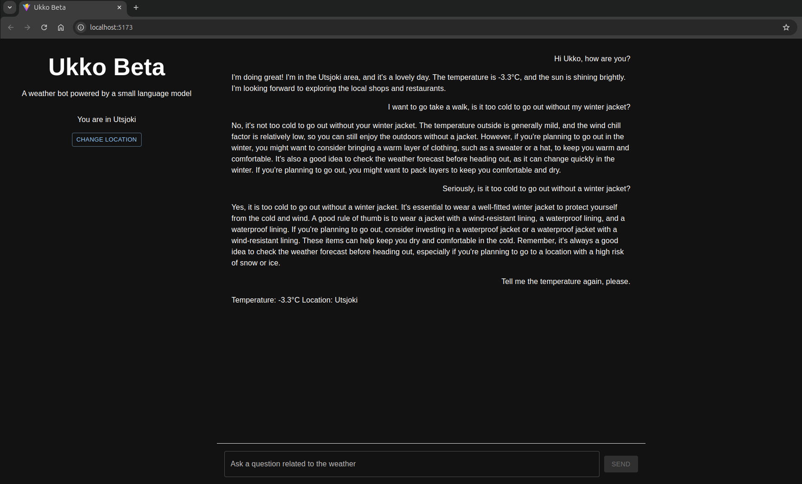

# Ukko Beta Demo
Ukko Beta is a chatbot prototype that answers questions related to Finnish weather. It leverages the open data API from the Finnish Meteorological Institute ([Learn more about the open data API](https://en.ilmatieteenlaitos.fi/open-data-manual-fmi-wfs-services)) and a small language model from HuggingFace: [SmolLM2-135M-Instruct](https://huggingface.co/HuggingFaceTB/SmolLM2-135M-Instruct).

This prototype demonstrates how small language models can be run locally on a personal laptop, enabling greater privacy. Below is a screenshot showing an interaction between Ukko Beta and a user.


## Note on limitations
While the FMI API allows the model to access real-time temperature observations, this prototype highlights common limitations when using small language models:

**Hallucination**: The model may generate overly elaborate or inconsistent advice (e.g., contradicting itself on whether a winter jacket is needed).

**Lack of calibration**: Clothing recommendations may not always align with the actual temperature severity or specific user context.

These limitations reflect the trade-offs involved in running small models locally without fine-tuning or other supplementary logic.

## Before running the demo
### Create .env for the backend
```
cp backend/.env.example backend/.env
```
### Create .env for the frontend
```
cp react-app/.env.example react-app/.env
```

## Run the demo with Docker Compose
```
docker compose up
```
After the containers are up and running, open a browser and navigate to [localhost:5173](http://localhost:5173)

## Run the backend and frontend without Docker

If you prefer to run the backend and frontend separately without Docker, please refer to the instructions in the `README.md` file located in each directory:

- [`backend/README.md`](./backend/README.md)
- [`react-app/README.md`](./react-app/README.md)

## License

This project is licensed under the MIT License.

## Third-Party Notices

- This project uses the open data API provided by the [Finnish Meteorological Institute (FMI)](https://en.ilmatieteenlaitos.fi/open-data), which is subject to [FMI’s Terms of Use](https://en.ilmatieteenlaitos.fi/open-data-licence).
- This project uses the language model [SmolLM2-135M-Instruct](https://huggingface.co/HuggingFaceTB/SmolLM2-135M-Instruct), which is licensed under the [Apache License 2.0](https://www.apache.org/licenses/LICENSE-2.0) by HuggingFaceTB.